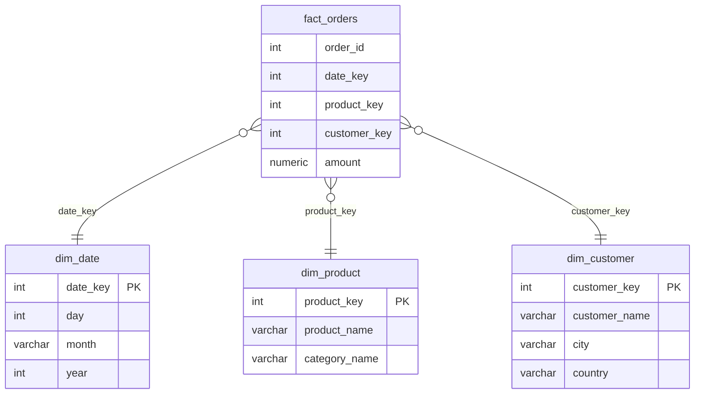
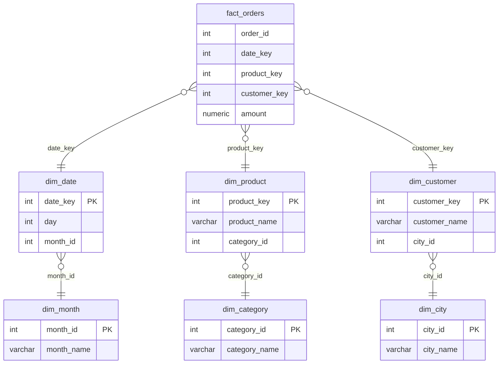
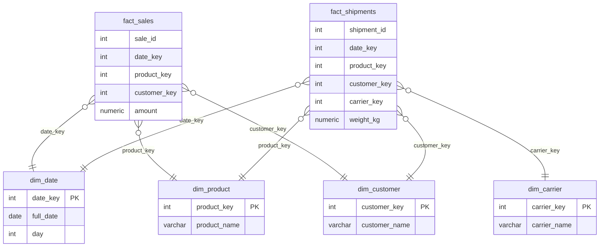

#### **Таблицы фактов (Fact Tables)**

- **Что это:** Центральные таблицы, которые содержат количественные, измеримые данные о бизнес-процессах (факты).

- **Содержание:**
    - **Ключи измерений (Foreign Keys):** Ссылки на таблицы измерений.
    - **Меры (Measures):** Числовые показатели, которые можно агрегировать (суммировать, усреднять). Например: `amount`, `quantity`, `price`, `duration_seconds`.

- **Пример:** Таблица `fact_sales` с полями `sales_id`, `date_key`, `product_key`, `customer_key`, `store_key`, `quantity_sold`, `total_amount`.

#### **Таблицы измерений (Dimension Tables)**

- **Что это:** Справочные таблицы, которые описывают объекты предметной области и содержат их атрибуты (описательные данные).

- **Содержание:**
    - **Ключ измерения (Primary Key):** Суррогатный ключ (обычно автоинкрементный `id`), не связанный с бизнес-системой.
    - **Атрибуты:** Текстовые или описательные поля. Например: `product_name`, `category_name`, `customer_address`, `store_region`.

- **Пример:** Таблица `dim_product` с полями `product_key`, `product_name`, `category_id`, `brand`, `supplier_id`.

---

### **2. Типы схем**

#### **1. Схема «Звезда» (Star Schema)**

- **Структура:** Одна большая таблица фактов в центре, связанная с несколькими таблицами измерений. Таблицы измерений **не нормализованы** (могут содержать избыточность).
    
- **Пример (Интернет-магазин):**
    
    - **Факты:** `fact_orders` (`order_id`, `date_key`, `product_key`, `customer_key`, `amount`)
        
    - **Измерения:**
        
        - `dim_date` (`date_key`, `day`, `month`, `year`, `quarter`, `is_weekend`)
            
        - `dim_product` (`product_key`, `product_name`, `category_name`) // Обратите внимание: `category_name` здесь, а не в отдельной таблице!
            
        - `dim_customer` (`customer_key`, `customer_name`, `city`, `country`)

- **Плюсы:**
    
    - **Простота:** Легко понять и спроектировать.
        
    - **Производительность:** Минимальное количество JOIN'ов для запросов.
        
- **Минусы:** Избыточность данных (например, названия категорий повторяются для каждого товара в одной категории).
    

#### **2. Схема «Снежинка» (Snowflake Schema)**

- **Структура:** Усовершенствованная «звезда», где таблицы измерений **нормализованы**. Это значит, что они могут сами ссылаться на другие таблицы измерений.
    
- **Пример (Тот же интернет-магазин):**
    
    - **Факты:** `fact_orders` (`order_id`, `date_key`, `product_key`, `customer_key`, `amount`)
        
    - **Измерения:**
        
        - `dim_date` (`date_key`, `day`, `month_id`, `year`) -> `dim_month` (`month_id`, `month_name`, `quarter_id`)
            
        - `dim_product` (`product_key`, `product_name`, `category_id`) -> `dim_category` (`category_id`, `category_name`)
            
        - `dim_customer` (`customer_key`, `customer_name`, `city_id`) -> `dim_city` (`city_id`, `city_name`, `country_id`)

- **Плюсы:**
    
    - **Отсутствие избыточности:** Экономия места (но это редко главный приоритет).
        
    - **Целостность данных:** Изменение атрибута (например, названия категории) происходит только в одном месте.
        
- **Минусы:**
    
    - **Сложность запросов:** Требуется больше JOIN'ов, что может ухудшить производительность.
        
    - **Сложность проектирования:** Модель сложнее для понимания.
        

#### **3. Схема «Созвездие» (Galaxy Schema или Fact Constellation)**

- **Структура:** Наличие **нескольких таблиц фактов**, которые **делят общие таблицы измерений**. По сути, это несколько схем «звезда» или «снежинка», соединенных вместе.
    
- **Пример (Интернет-магазин + логистика):**
    
    - **Факт 1:** `fact_sales` (`sale_id`, `date_key`, `product_key`, `customer_key`, `amount`)
        
    - **Факт 2:** `fact_shipments` (`shipment_id`, `date_key`, `product_key`, `customer_key`, `carrier_key`, `weight_kg`)
        
    - **Общие измерения:** `dim_date`, `dim_product`, `dim_customer`
        
    - **Частные измерения:** `dim_carrier` (только для `fact_shipments`)

- **Применение:** Для сложных хранилищ данных, где несколько бизнес-процессов тесно связаны между собой.
    

---

### **2. Возможные дополнительные вопросы и ответы**

**1. Вопрос: Какую схему выбрать для проекта? «Звезду» или «снежинку»?**  
**Ответ:** В 95% случаев **«Звезда»**. Вот почему:

- **Производительность важнее дискового пространства.** JOIN'ы — это дорогостоящие операции в колоночных СУБД (ClickHouse, Amazon Redshift), оптимизированных под OLAP. «Звезда» минимизирует их количество.
    
- **Упрощение ETL.** Загрузить одну денormalлизованную таблицу измерений проще, чем загружать несколько нормализованных с поддержанием связей.
    
- **Удобство для аналитиков.** Запросы к «звезде» пишутся и понимаются гораздо легче.  
    «Снежинку» имеет смысл использовать, если есть очень большие и иерархические справочники, которые обновляются часто, и их денормализация приведет к гигантской избыточности.
    

**2. Вопрос: Что такое конформизм измерений?**  
**Ответ:** Это ключевое понятие для схемы «созвездие». Конформизм измерений означает, что одинаковые измерения в разных витринах данных должны иметь одинаковую структуру и содержание. Например, `dim_date` из витрины продаж и `dim_date` из витрины логистики должны использовать один и тот же суррогатный ключ (`date_key`) и иметь одинаковый набор атрибутов. Это позволяет корректно соединять данные из разных фактов на основе общих измерений.

**3. Вопрос: В чем разница между хранением в DWH и витриной данных?**  
**Ответ:**

- **Хранилище данных (DWH)** — это централизованное хранилище, содержащее данные из множества источников, очищенные и приведенные к единому формату. Оно обычно построено по схеме «снежинка» или «созвездие».
    
- **Витрина данных (Data Mart)** — это специализированное подмножество DWH, предназначенное для конкретной предметной области (например, отдел продаж). Она обычно имеет схему «звезда» для максимальной производительности и простоты.
    

---

### **3. Особенности и "подводные камни"**

1. **Выбор гранулярности фактовой таблицы — это самое важное решение.**
    
    - **Подводный камень:** Слишком общая гранулярность (например, итоги за день) не позволит анализировать детальные данные.
        
    - **Решение:** Старайтесь закладывать максимально детальную гранулярность (на уровне отдельного события: продажа, клик, заказ). Агрегированные данные всегда можно построить из детальных, а вот наоборот — нельзя.
        
2. **Использование суррогатных ключей.**
    
    - **Подводный камень:** Использование бизнес-ключей (например, `product_sku`) в качестве первичных ключей в измерениях и для соединений.
        
    - **Проблема:** Бизнес-ключи могут меняться (SKU товара может переиспользоваться), что ломает историчность (slowly changing dimensions).
        
    - **Решение:** Всегда использовать бессмысленные, автоинкрементные суррогатные ключи (`id`, `product_key`). Бизнес-ключ хранить просто как атрибут в измерении.
        
3. **Производительность больших фактовых таблиц.**
    
    - **Подводный камень:** Фактовые таблицы могут расти на миллиарды строк. Запросы к ним без правильной индексации и партиционирования будут выполняться очень медленно.
        
    - **Решение:**
        
        - **Партиционирование:** По дате (`date_key`) — самый частый случай.
            
        - **Кластеризация:** В колоночных базах данных данные хранятся по столбцам, что ускоряет агрегации.
            
        - **Индексы:** Использование индексов для часто используемых полей соединения.
            
4. **Slowly Changing Dimensions (SCD).**
    
    - **Подводный камень:** Атрибуты измерений меняются со временем (клиент меняет город, товар меняет категорию). Как хранить историю изменений, чтобы отчеты за прошлые периоды оставались корректными?
        
    - **Решение:** Существуют различные стратегии SCD (Тип 1 - перезапись, Тип 2 - создание новой версии записи, Тип 3 - хранение предыдущего значения). Это отдельная большая тема, но критически важная для любого ETL-инженера.